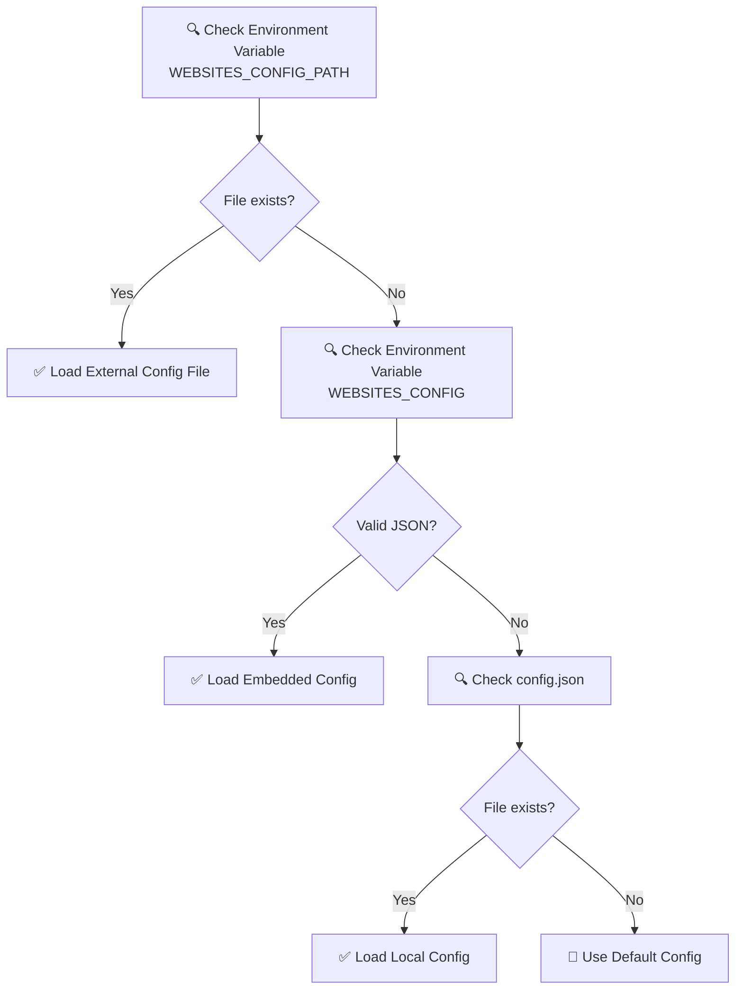

# 🌐 Website to Markdown MCP Server

<div align="center">

**Language**: [English](README.md) | [繁體中文](README.zh-TW.md)

</div>

> A powerful Model Context Protocol (MCP) server designed for fetching website content and converting it to Markdown format, making it easier for AI to understand and process website information.

## ✨ Key Features

<div align="center">

| 🌟 Enhanced Processing | 📊 OpenAPI Support | ⚙️ Smart Analysis | 🎯 Advanced Extraction |
|:--------:|:-------------:|:----------:|:----------:|
| AI-powered content cleanup | OpenAPI 3.x/Swagger 2.0 | Reading time calculation | Main content detection |
| Auto ad removal | Professional validation | Word count statistics | Language detection |
| Content summarization | Structured API parsing | Smart retry mechanism | Multi-format support |

</div>

---

## 🆕 What's New in v1.2.0

<div align="center">

### 🚀 Major Enhancements

</div>

| Feature | Status | Description |
|:-----|:----------:|:-----|
| 🧠 **Enhanced Content Processor** | ✅ | AI-powered content cleaning and extraction |
| 📊 **Smart Analytics** | ✅ | Word count, reading time, content summary |
| 🌍 **Language Detection** | ✅ | Automatic language identification |
| 🎯 **Intelligent Retry** | ✅ | Smart retry mechanism with exponential backoff |
| 🔍 **Stealth Browser** | ✅ | Anti-detection browsing capabilities |
| ⚡ **Rate Limiting** | ✅ | Built-in rate limiting and concurrency control |
| 🧹 **Content Cleanup** | ✅ | Remove ads, navigation, and irrelevant content |
| 📝 **Enhanced Markdown** | ✅ | Support for strikethrough, underline, highlights |

---

## 🚀 Quick Start

### 🎯 Method 1: NPX Installation (🌟 Recommended)

> 💡 **Easiest way**: No local installation needed!

#### **Step 1**: Create Configuration File 📄

Create a `my-websites.json` file:

```json
{
  "websites": [
    {
      "name": "your_website",
      "url": "https://your-website.com",
      "description": "Your Project Website"
    },
    {
      "name": "api_docs",
      "url": "https://api.example.com/openapi.json",
      "description": "Your API Specification"
    }
  ]
}
```

#### **Step 2**: Configure MCP Server ⚙️

Add to `.cursor/mcp.json`:

```json
{
  "mcpServers": {
    "website-to-markdown": {
      "command": "npx",
      "args": ["-y", "website-to-markdown-mcp"],
      "disabled": false,
      "env": {
        "WEBSITES_CONFIG_PATH": "./my-websites.json"
      }
    }
  }
}
```

#### **Step 3**: Restart and Test 🔄

1. **Restart Cursor**
2. **Open Chat and use Agent mode**
3. **Test command**: `Please list all configured websites`

<div align="center">

**🎉 Done! No installation required!**

</div>

---

### 🎯 Method 2: Local Installation

> 💡 **Best Practice**: Use this method for development or customization!

#### **Step 1**: Clone and Build

```bash
git clone https://github.com/your-username/website-to-markdown-mcp.git
cd website-to-markdown-mcp
npm install
npm run build
```

#### **Step 2**: Configure MCP Server

Add to `.cursor/mcp.json`:

```json
{
  "mcpServers": {
    "website-to-markdown": {
      "command": "cmd",
      "args": ["/c", "node", "./website-to-markdown-mcp/dist/index.js"],
      "disabled": false,
      "env": {
        "WEBSITES_CONFIG_PATH": "./my-websites.json"
      }
    }
  }
}
```

---

## 🔥 Enhanced Output Features

### 📊 Rich Content Analysis

Every fetched content now includes:

- **📝 Content Summary**: AI-generated summary of the main content
- **⏱️ Reading Time**: Estimated reading time based on content length
- **🔢 Word Count**: Accurate word count for both English and Chinese
- **🌍 Language Detection**: Automatic language identification
- **🎯 Content Quality Score**: Assessment of content relevance

### 📋 Enhanced Markdown Output

```markdown
# 🚀 Example Website

**Source**: https://example.com
**Website**: example_site - Example Website
**📊 Reading Time**: 5 minutes
**🔢 Word Count**: 1,250 words
**🌍 Language**: English
**📝 Summary**: This article discusses the latest developments in web technology...

---

[Enhanced Markdown content with better formatting...]
```

---

## 🆕 Complete OpenAPI/Swagger Support

<div align="center">

### 🔥 Professional API Documentation

</div>

| Feature | OpenAPI 3.x | Swagger 2.0 | Description |
|:-----|:----------:|:-----------:|:-----|
| 🔍 **Auto Detection** | ✅ | ✅ | Support JSON/YAML formats |
| ✅ **Professional Validation** | ✅ | ✅ | Using `@readme/openapi-parser` |
| 📋 **Structured Parsing** | ✅ | ✅ | Endpoints, parameters, responses |
| 🔗 **Reference Resolution** | ✅ | ✅ | Auto handle `$ref` references |
| 📊 **Smart Summary** | ✅ | ✅ | Generate API overview |
| 📝 **Formatted Output** | ✅ | ✅ | Readable Markdown |

### 🌟 Pre-configured Example Websites

```json
{
  "websites": [
    {
      "name": "petstore_openapi",
      "url": "https://petstore3.swagger.io/api/v3/openapi.json",
      "description": "🐕 Swagger Petstore OpenAPI 3.0 Spec (Demo)"
    },
    {
      "name": "petstore_swagger",
      "url": "https://petstore.swagger.io/v2/swagger.json",
      "description": "🐱 Swagger Petstore Swagger 2.0 Spec (Demo)"
    },
    {
      "name": "github_api",
      "url": "https://raw.githubusercontent.com/github/rest-api-description/main/descriptions/api.github.com/api.github.com.json",
      "description": "🐙 GitHub REST API OpenAPI Spec"
    }
  ]
}
```

---

## 📦 Installation & Setup

### 🛠️ System Requirements

- **Node.js** 20.18.1+ (Recommended: v22.15.0 LTS) 
- **npm** 10.0.0+ or **yarn**
- **Cursor** Editor

> ⚠️ **Important**: Some dependencies require Node.js v20.18.1 or higher. Please update your Node.js version if you encounter engine compatibility warnings.

### ⚡ NPM Package Installation

```bash
# Global installation
npm install -g website-to-markdown-mcp

# Or use directly with npx (recommended)
npx website-to-markdown-mcp
```

### 🔧 Development Setup

```bash
# 1. Clone repository
git clone https://github.com/your-username/website-to-markdown-mcp.git
cd website-to-markdown-mcp

# 2. Install dependencies
npm install

# 3. Build project
npm run build
```

### 🎛️ Advanced Configuration Options

<div align="center">

#### Configuration Priority Order

</div>



---

## 🎨 Configuration Method Details

### 📋 Method 1: External Configuration File (🌟 Recommended)

> 💡 **Advantages**: Easy to edit, syntax highlighting, version control friendly

<details>
<summary><b>🔧 Detailed Setup Steps</b></summary>

1. **Create Configuration File**
   ```bash
   # Can be placed anywhere
   touch my-api-configs.json
   ```

2. **Edit Configuration Content**
   ```json
   {
     "websites": [
       {
         "name": "my_docs",
         "url": "https://docs.example.com",
         "description": "📚 My Documentation Website"
       }
     ]
   }
   ```

3. **Set Environment Variable**
   ```json
   {
     "env": {
       "WEBSITES_CONFIG_PATH": "./my-api-configs.json"
     }
   }
   ```

</details>

### 📋 Method 2: Embedded JSON (Backward Compatible)

<details>
<summary><b>🔧 Configuration Example</b></summary>

```json
{
  "mcpServers": {
    "website-to-markdown": {
      "command": "cmd",
      "args": ["/c", "node", "./website-to-markdown-mcp/dist/index.js"],
      "disabled": false,
      "env": {
        "WEBSITES_CONFIG": "{\"websites\":[{\"name\":\"example\",\"url\":\"https://example.com\",\"description\":\"Example Website\"}]}"
      }
    }
  }
}
```

</details>

### 📋 Method 3: Local config.json

<details>
<summary><b>🔧 Local Configuration</b></summary>

Directly edit `config.json` in the project root directory:

```json
{
  "websites": [
    {
      "name": "local_site",
      "url": "https://local.example.com",
      "description": "🏠 Local Test Website"
    }
  ]
}
```

</details>

---

## 🔧 Available Tools

### 🌐 General Tools

| Tool Name | Function | Parameters | Example |
|:--------|:-----|:-----|:-----|
| `fetch_website` | Fetch any website | `url`: Website URL | Fetch OpenAPI spec files |
| `list_configured_websites` | List configured websites | None | View all available websites |

### 🎯 Dedicated Tools

Each configured website automatically generates corresponding dedicated tools:

- `fetch_petstore_openapi` - Fetch Petstore OpenAPI 3.0 spec
- `fetch_petstore_swagger` - Fetch Petstore Swagger 2.0 spec  
- `fetch_github_api` - Fetch GitHub API spec
- `fetch_tailwind_css` - Fetch Tailwind CSS documentation

---

## 📊 Enhanced Output Format Examples

### 🌐 General Website Content with Analytics

```markdown
# Website Title

**Source**: https://example.com
**Website**: example_site - Example Website
**📊 Reading Time**: 3 minutes
**🔢 Word Count**: 650 words
**🌍 Language**: English
**📝 Summary**: This article provides a comprehensive overview of modern web development practices, covering frontend frameworks, backend technologies, and deployment strategies.

---

[Enhanced cleaned Markdown content with ads removed and main content extracted...]
```

### 📋 OpenAPI 3.x Specification File

```markdown
# 🚀 Example API (v2.1.0)

**Source**: https://api.example.com/openapi.json
**OpenAPI Version**: 3.0.3
**Validation Status**: ✅ Valid
**📊 Processing Time**: 1.2 seconds
**🔢 Endpoints**: 25 endpoints
**🌍 Server Locations**: 3 servers

---

## 📋 API Basic Information

- **API Name**: Example API
- **Version**: 2.1.0
- **OpenAPI Version**: 3.0.3
- **Description**: A powerful example API for modern applications

## 🌐 Servers

1. **https://api.example.com**
   - 🏢 Production server
2. **https://staging-api.example.com**
   - 🧪 Testing server

## 🛠️ API Endpoints

Total of **25** endpoints:

### 👥 `/users`
- **GET**: Get user list
- **POST**: Create new user

### 🔍 `/users/{id}`
- **GET**: Get specific user
- **PUT**: Update user information
- **DELETE**: Delete user

## 🧩 Components

- **Schemas**: 12 data models
- **Parameters**: 8 reusable parameters  
- **Responses**: 15 reusable responses
- **Security Schemes**: 3 security mechanisms
```

---

## 🎯 Usage Examples

### 💻 Basic Usage

```
Please fetch the content from https://docs.example.com and convert to markdown
```

### 🔍 OpenAPI Specification Fetching

```
Please use the fetch_petstore_openapi tool to fetch Petstore OpenAPI specification
```

### 📚 Documentation Website Fetching

```
Please fetch React official documentation content
```

---

## 🚨 Troubleshooting

> 📋 **Complete Troubleshooting Guide**: See [TROUBLESHOOTING.md](TROUBLESHOOTING.md) for detailed solutions to common issues.

### ❓ Quick Solutions

<details>
<summary><b>🔧 Node.js Version Issues</b></summary>

**Error**: `npm WARN EBADENGINE Unsupported engine`
- **Solution**: Update Node.js to v20.18.1 or higher
- **Download**: [Node.js Official Website](https://nodejs.org/)
- **Verify**: `node --version`

</details>

<details>
<summary><b>🌐 Module Not Found Issues</b></summary>

**Error**: `Cannot find module './db.json'`
- **Solution 1**: Clear npm cache: `npm cache clean --force`
- **Solution 2**: Update Node.js version
- **Solution 3**: Use local installation instead of npx

</details>

<details>
<summary><b>⚙️ Configuration Issues</b></summary>

**Q: Configuration changes not taking effect?**
- ✅ Confirm JSON format is correct
- ✅ Restart Cursor
- ✅ Check environment variable names

**Q: JSON format errors?**
- 🛠️ Use [JSON Validator](https://jsonlint.com/)
- 🛠️ Confirm using double quotes
- 🛠️ Check for extra commas

</details>

### 🔍 Debug Mode

Detailed logs are output to stderr at startup:

```bash
# View debug messages
npm run dev 2> debug.log
```

---

## 📈 Performance & Optimization

### ⚡ Performance Features

- 🚀 **Smart Retry**: Intelligent retry with exponential backoff
- 💾 **Rate Limiting**: Built-in rate limiting to prevent overload
- 🎯 **Content Filtering**: Remove irrelevant content for faster processing
- 🧹 **Ad Removal**: Automatic ad and popup removal
- 📊 **Stealth Mode**: Anti-detection browsing capabilities

### 🛡️ Security Considerations

- 🔒 HTTPS websites only (recommended)
- 🛠️ Auto filter malicious scripts
- 📝 Limit output content length
- 🔐 Stealth browsing to avoid detection

---

## 📦 Dependencies

<div align="center">

| Package | Version | Purpose |
|:-----|:----:|:-----|
| `@modelcontextprotocol/sdk` | ^1.0.0 | MCP Core Framework |
| `@readme/openapi-parser` | ^4.1.0 | Professional OpenAPI Parsing |
| `axios` | ^1.6.0 | HTTP Request Handling |
| `cheerio` | ^1.0.0 | HTML Parsing Engine |
| `turndown` | ^7.1.2 | HTML to Markdown |
| `yaml` | ^2.8.0 | YAML Format Support |
| `zod` | ^3.22.0 | Data Validation Framework |
| `playwright` | ^1.40.0 | Browser automation |

</div>

---

## 📝 Changelog

### 🎉 v1.2.0 (Latest)

<div align="center">

**🚀 Major Feature Updates**

</div>

- ✨ **Added** Enhanced content processing with AI-powered cleanup
- ✨ **Added** Smart analytics: word count, reading time, content summary
- ✨ **Added** Language detection and multi-language support
- ✨ **Added** Stealth browser capabilities for anti-detection
- ✨ **Added** Built-in rate limiting and retry mechanisms
- ✨ **Added** Advanced content filtering and ad removal
- 🔧 **Enhanced** Markdown processing with more HTML element support
- 📊 **Improved** Output format with rich metadata
- 🎯 **Fixed** Various technical issues and dependencies

### 🎯 v1.1.0 (Previous)

<div align="center">

**🚀 Major Feature Updates**

</div>

- ✨ **Added** Full OpenAPI 3.x/Swagger 2.0 support
- ✨ **Added** JSON/YAML format auto-detection  
- ✨ **Added** Professional-grade spec validation and reference resolution
- ✨ **Added** Version auto-adaptation mechanism
- ✨ **Added** Structured API documentation summary
- 🔧 **Pre-configured** Multiple OpenAPI/Swagger examples
- 📦 **Added** NPM package distribution with npx support
- 🎯 **Enhanced** Installation methods for better user experience

### 🎯 v1.0.0 (Stable)

- 🎉 **Initial Release**
- 🌐 **Basic Functions** Website content fetching
- 📝 **Core Functions** Markdown conversion  
- ⚙️ **Configuration Support** Multi-website management

---

## 🤝 Contributing

### 💡 How to Contribute

1. **🍴 Fork** this project
2. **🌟 Create** feature branch (`git checkout -b feature/AmazingFeature`)
3. **📝 Commit** changes (`git commit -m 'Add some AmazingFeature'`)
4. **📤 Push** to branch (`git push origin feature/AmazingFeature`)
5. **🔄 Open** Pull Request

### 🐛 Issue Reporting

Report issues on the [Issues](https://github.com/your-repo/issues) page, please include:

- 🔍 **Issue Description**
- 🔄 **Reproduction Steps**  
- 💻 **Environment Information**
- 📸 **Screenshots or Logs**

---

## 📄 License

This project is licensed under the MIT License - see the [LICENSE](LICENSE) file for details.

---

<div align="center">

### 🌟 If this project helps you, please give it a Star!

**💬 Have questions or suggestions? Feel free to open an Issue!**

---

**Made by Sun** ❤️ **for the Developer Community**

</div> 