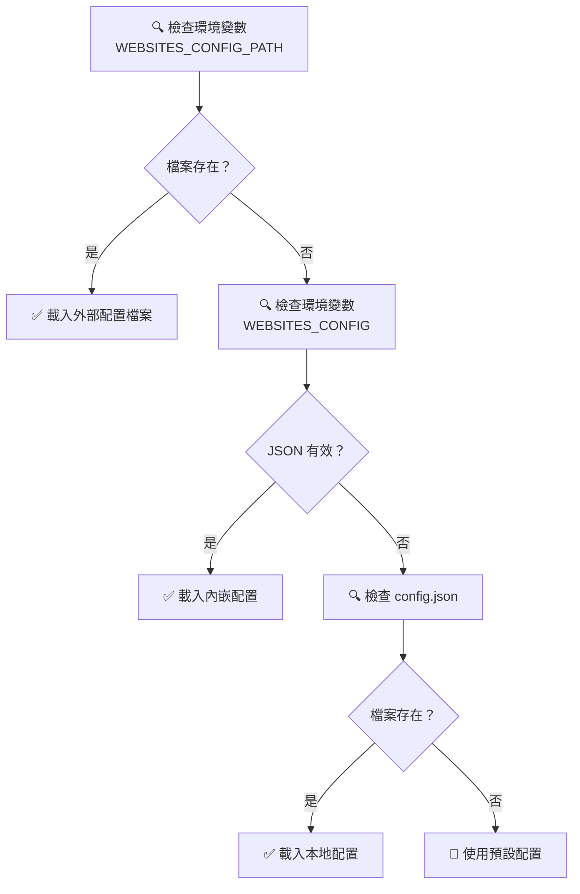

# 🌐 Website to Markdown MCP Server

<div align="center">

**語言**: [English](README.md) | [繁體中文](README.zh-TW.md)

</div>

> 一個強大的 Model Context Protocol (MCP) 伺服器，專為抓取網站內容並轉換為 Markdown 格式而設計，讓 AI 更容易理解和處理網站資訊。

## ✨ 主要特色

<div align="center">

| 🌟 增強處理 | 📊 OpenAPI 支援 | ⚙️ 智慧分析 | 🎯 進階擷取 |
|:--------:|:-------------:|:----------:|:----------:|
| AI 驅動內容清理 | OpenAPI 3.x/Swagger 2.0 | 閱讀時間計算 | 主要內容偵測 |
| 自動廣告移除 | 專業規格驗證 | 字數統計 | 語言識別 |
| 內容摘要生成 | 結構化 API 解析 | 智慧重試機制 | 多格式支援 |

</div>

---

## 🆕 v1.2.0 版本新功能

<div align="center">

### 🚀 重大功能增強

</div>

| 功能 | 狀態 | 描述 |
|:-----|:----------:|:-----|
| 🧠 **增強內容處理器** | ✅ | AI 驅動的內容清理和擷取 |
| 📊 **智慧分析** | ✅ | 字數、閱讀時間、內容摘要 |
| 🌍 **語言檢測** | ✅ | 自動語言識別 |
| 🎯 **智慧重試** | ✅ | 指數退避智慧重試機制 |
| 🔍 **隱身瀏覽器** | ✅ | 反偵測瀏覽功能 |
| ⚡ **速率限制** | ✅ | 內建速率限制和並發控制 |
| 🧹 **內容清理** | ✅ | 移除廣告、導航和無關內容 |
| 📝 **增強 Markdown** | ✅ | 支援刪除線、底線、螢光標記 |

---

## 🚀 快速開始

### 🎯 方法 1：NPX 安裝（🌟 推薦）

> 💡 **最簡單的方式**：無需本地安裝！

#### **步驟 1**：建立配置檔案 📄

建立 `my-websites.json` 檔案：

```json
{
  "websites": [
    {
      "name": "your_website",
      "url": "https://your-website.com",
      "description": "您的專案網站"
    },
    {
      "name": "api_docs",
      "url": "https://api.example.com/openapi.json",
      "description": "您的 API 規格文件"
    }
  ]
}
```

#### **步驟 2**：配置 MCP 伺服器 ⚙️

在 `.cursor/mcp.json` 中新增：

```json
{
  "mcpServers": {
    "website-to-markdown": {
      "command": "npx",
      "args": ["-y", "website-to-markdown-mcp"],
      "disabled": false,
      "env": {
        "WEBSITES_CONFIG_PATH": "./my-websites.json"
      }
    }
  }
}
```

#### **步驟 3**：重啟並測試 🔄

1. **重新啟動 Cursor**
2. **開啟 Chat 並使用 Agent 模式**
3. **測試指令**：`請列出所有已配置的網站`

<div align="center">

**🎉 完成！無需安裝！**

</div>

---

### 🎯 方法 2：本地安裝

> 💡 **最佳實踐**：適用於開發或客製化需求！

#### **步驟 1**：複製並建置

```bash
git clone https://github.com/your-username/website-to-markdown-mcp.git
cd website-to-markdown-mcp
npm install
npm run build
```

#### **步驟 2**：配置 MCP 伺服器

在 `.cursor/mcp.json` 中新增：

```json
{
  "mcpServers": {
    "website-to-markdown": {
      "command": "cmd",
      "args": ["/c", "node", "./website-to-markdown-mcp/dist/index.js"],
      "disabled": false,
      "env": {
        "WEBSITES_CONFIG_PATH": "./my-websites.json"
      }
    }
  }
}
```

---

## 🔥 增強輸出功能

### 📊 豐富內容分析

每次抓取的內容現在都包含：

- **📝 內容摘要**：AI 生成的主要內容摘要
- **⏱️ 閱讀時間**：基於內容長度的預估閱讀時間
- **🔢 字數統計**：中英文準確字數統計
- **🌍 語言檢測**：自動語言識別
- **🎯 內容品質評分**：內容相關性評估

### 📋 增強 Markdown 輸出

```markdown
# 🚀 範例網站

**來源**: https://example.com
**網站**: example_site - 範例網站
**📊 閱讀時間**: 5 分鐘
**🔢 字數**: 1,250 字
**🌍 語言**: 繁體中文
**📝 摘要**: 本文討論了網路技術的最新發展...

---

[增強格式的 Markdown 內容...]
```

---

## 🆕 OpenAPI/Swagger 完整支援

<div align="center">

### 🔥 專業 API 文件

</div>

| 功能 | OpenAPI 3.x | Swagger 2.0 | 說明 |
|:-----|:----------:|:-----------:|:-----|
| 🔍 **自動檢測** | ✅ | ✅ | 支援 JSON/YAML 格式 |
| ✅ **專業驗證** | ✅ | ✅ | 使用 `@readme/openapi-parser` |
| 📋 **結構化解析** | ✅ | ✅ | 端點、參數、回應等 |
| 🔗 **引用解析** | ✅ | ✅ | 自動處理 `$ref` 引用 |
| 📊 **智慧摘要** | ✅ | ✅ | 生成 API 概覽 |
| 📝 **格式化輸出** | ✅ | ✅ | 易讀的 Markdown |

### 🌟 預配置範例網站

```json
{
  "websites": [
    {
      "name": "petstore_openapi",
      "url": "https://petstore3.swagger.io/api/v3/openapi.json",
      "description": "🐕 Swagger Petstore OpenAPI 3.0 規格（示範）"
    },
    {
      "name": "petstore_swagger",
      "url": "https://petstore.swagger.io/v2/swagger.json",
      "description": "🐱 Swagger Petstore Swagger 2.0 規格（示範）"
    },
    {
      "name": "github_api",
      "url": "https://raw.githubusercontent.com/github/rest-api-description/main/descriptions/api.github.com/api.github.com.json",
      "description": "🐙 GitHub REST API OpenAPI 規格"
    }
  ]
}
```

---

## 📦 安裝與設定

### 🛠️ 系統需求

- **Node.js** 20.18.1+ (推薦：v22.15.0 LTS) 
- **npm** 10.0.0+ 或 **yarn**
- **Cursor** 編輯器

> ⚠️ **重要提醒**：某些依賴需要 Node.js v20.18.1 或更高版本。如果遇到引擎相容性警告，請更新您的 Node.js 版本。

### ⚡ NPM 套件安裝

```bash
# 全域安裝
npm install -g website-to-markdown-mcp

# 或直接使用 npx（推薦）
npx website-to-markdown-mcp
```

### 🔧 開發環境設定

```bash
# 1. 複製儲存庫
git clone https://github.com/your-username/website-to-markdown-mcp.git
cd website-to-markdown-mcp

# 2. 安裝相依套件
npm install

# 3. 建置專案
npm run build
```

### 🎛️ 進階配置選項

<div align="center">

#### 配置方式優先順序

</div>



---

## 🎨 配置方法詳解

### 📋 方法 1：外部配置檔案（🌟 推薦）

> 💡 **優勢**：易於編輯、語法高亮、版本控制友好

<details>
<summary><b>🔧 詳細設定步驟</b></summary>

1. **建立配置檔案**
   ```bash
   # 可以放在任何位置
   touch my-api-configs.json
   ```

2. **編輯配置內容**
   ```json
   {
     "websites": [
       {
         "name": "my_docs",
         "url": "https://docs.example.com",
         "description": "📚 我的文件網站"
       }
     ]
   }
   ```

3. **設定環境變數**
   ```json
   {
     "env": {
       "WEBSITES_CONFIG_PATH": "./my-api-configs.json"
     }
   }
   ```

</details>

### 📋 方法 2：內嵌 JSON（向後相容）

<details>
<summary><b>🔧 設定範例</b></summary>

```json
{
  "mcpServers": {
    "website-to-markdown": {
      "command": "cmd",
      "args": ["/c", "node", "./website-to-markdown-mcp/dist/index.js"],
      "disabled": false,
      "env": {
        "WEBSITES_CONFIG": "{\"websites\":[{\"name\":\"example\",\"url\":\"https://example.com\",\"description\":\"範例網站\"}]}"
      }
    }
  }
}
```

</details>

### 📋 方法 3：本地 config.json

<details>
<summary><b>🔧 本地配置</b></summary>

直接編輯專案根目錄的 `config.json`：

```json
{
  "websites": [
    {
      "name": "local_site",
      "url": "https://local.example.com",
      "description": "🏠 本地測試網站"
    }
  ]
}
```

</details>

---

## 🔧 可用工具

### 🌐 通用工具

| 工具名稱 | 功能 | 參數 | 範例 |
|:--------|:-----|:-----|:-----|
| `fetch_website` | 抓取任意網站 | `url`: 網站網址 | 抓取 OpenAPI 規格檔案 |
| `list_configured_websites` | 列出配置的網站 | 無 | 查看所有可用網站 |

### 🎯 專用工具

每個配置的網站都會自動產生對應的專用工具：

- `fetch_petstore_openapi` - 抓取 Petstore OpenAPI 3.0 規格
- `fetch_petstore_swagger` - 抓取 Petstore Swagger 2.0 規格  
- `fetch_github_api` - 抓取 GitHub API 規格
- `fetch_tailwind_css` - 抓取 Tailwind CSS 文件

---

## 📊 增強輸出格式範例

### 🌐 一般網站內容與分析

```markdown
# 網站標題

**來源**: https://example.com
**網站**: example_site - 範例網站
**📊 閱讀時間**: 3 分鐘
**🔢 字數**: 650 字
**🌍 語言**: 繁體中文
**📝 摘要**: 本文提供了現代網頁開發實踐的全面概述，涵蓋前端框架、後端技術和部署策略。

---

[已清理廣告並擷取主要內容的增強 Markdown 內容...]
```

### 📋 OpenAPI 3.x 規格檔案

```markdown
# 🚀 Example API (v2.1.0)

**來源**: https://api.example.com/openapi.json
**OpenAPI 版本**: 3.0.3
**驗證狀態**: ✅ 有效
**📊 處理時間**: 1.2 秒
**🔢 端點數量**: 25 個端點
**🌍 伺服器位置**: 3 台伺服器

---

## 📋 API 基本資訊

- **API 名稱**: Example API
- **版本**: 2.1.0
- **OpenAPI 版本**: 3.0.3
- **描述**: 一個適用於現代應用程式的強大範例 API

## 🌐 伺服器

1. **https://api.example.com**
   - 🏢 生產環境伺服器
2. **https://staging-api.example.com**
   - 🧪 測試環境伺服器

## 🛠️ API 端點

總共有 **25** 個端點：

### 👥 `/users`
- **GET**: 取得使用者列表
- **POST**: 建立新使用者

### 🔍 `/users/{id}`
- **GET**: 取得特定使用者
- **PUT**: 更新使用者資訊
- **DELETE**: 刪除使用者

## 🧩 元件

- **Schemas**: 12 個資料模型
- **Parameters**: 8 個可重用參數  
- **Responses**: 15 個可重用回應
- **Security Schemes**: 3 個安全機制
```

---

## 🎯 使用範例

### 💻 基本使用

```
請抓取 https://docs.example.com 的內容並轉換為 markdown
```

### 🔍 OpenAPI 規格抓取

```
請使用 fetch_petstore_openapi 工具抓取 Petstore 的 OpenAPI 規格
```

### 📚 文件網站抓取

```
請抓取 React 官方文件的內容
```

---

## 🚨 疑難排解

### ❓ 常見問題

<details>
<summary><b>🔧 Node.js 版本問題</b></summary>

**錯誤**: `npm WARN EBADENGINE Unsupported engine`
- **解決方案**: 更新 Node.js 至 v20.18.1 或更高版本
- **下載**: [Node.js 官方網站](https://nodejs.org/)
- **驗證**: `node --version`

</details>

<details>
<summary><b>🌐 模組找不到問題</b></summary>

**錯誤**: `Cannot find module './db.json'`
- **解決方案 1**: 清除 npm 快取: `npm cache clean --force`
- **解決方案 2**: 更新 Node.js 版本
- **解決方案 3**: 使用本地安裝而非 npx

</details>

<details>
<summary><b>⚙️ 配置相關問題</b></summary>

**Q: 配置修改後沒有生效？**
- ✅ 確認 JSON 格式正確
- ✅ 重新啟動 Cursor
- ✅ 檢查環境變數名稱

**Q: JSON 格式錯誤？**
- 🛠️ 使用 [JSON 驗證器](https://jsonlint.com/)
- 🛠️ 確認使用雙引號
- 🛠️ 檢查是否有多餘逗號

</details>

### 🔍 除錯模式

啟動時會在 stderr 輸出詳細日誌：

```bash
# 查看除錯訊息
npm run dev 2> debug.log
```

---

## 📈 效能與最佳化

### ⚡ 效能功能

- 🚀 **智慧重試**：指數退避智慧重試
- 💾 **速率限制**：內建速率限制防止過載
- 🎯 **內容過濾**：移除無關內容加快處理速度
- 🧹 **廣告移除**：自動廣告和彈窗移除
- 📊 **隱身模式**：反偵測瀏覽功能

### 🛡️ 安全考量

- 🔒 僅支援 HTTPS 網站（推薦）
- 🛠️ 自動過濾惡意腳本
- 📝 限制輸出內容長度
- 🔐 隱身瀏覽避免偵測

---

## 📦 相依套件

<div align="center">

| 套件 | 版本 | 用途 |
|:-----|:----:|:-----|
| `@modelcontextprotocol/sdk` | ^1.0.0 | MCP 核心框架 |
| `@readme/openapi-parser` | ^4.1.0 | 專業 OpenAPI 解析 |
| `axios` | ^1.6.0 | HTTP 請求處理 |
| `cheerio` | ^1.0.0 | HTML 解析引擎 |
| `turndown` | ^7.1.2 | HTML 轉 Markdown |
| `yaml` | ^2.8.0 | YAML 格式支援 |
| `zod` | ^3.22.0 | 資料驗證框架 |
| `playwright` | ^1.40.0 | 瀏覽器自動化 |

</div>

---

## 📝 更新日誌

### 🎉 v1.2.0 (最新版本)

<div align="center">

**🚀 重大功能更新**

</div>

- ✨ **新增** AI 驅動的增強內容處理與清理
- ✨ **新增** 智慧分析：字數、閱讀時間、內容摘要
- ✨ **新增** 語言檢測和多語言支援
- ✨ **新增** 反偵測隱身瀏覽器功能
- ✨ **新增** 內建速率限制和重試機制
- ✨ **新增** 進階內容過濾和廣告移除
- 🔧 **增強** Markdown 處理，支援更多 HTML 元素
- 📊 **改進** 輸出格式，包含豐富元數據
- 🎯 **修正** 各種技術問題和依賴項目

### 🎯 v1.1.0 (前一版本)

<div align="center">

**🚀 重大功能更新**

</div>

- ✨ **新增** OpenAPI 3.x/Swagger 2.0 完整支援
- ✨ **新增** JSON/YAML 格式自動檢測  
- ✨ **新增** 專業級規格驗證與引用解析
- ✨ **新增** 版本自動適配機制
- ✨ **新增** 結構化 API 文件摘要
- 🔧 **預配置** 多個 OpenAPI/Swagger 範例
- 📦 **新增** NPM 套件發布，支援 npx 使用
- 🎯 **增強** 安裝方式，提升使用者體驗

### 🎯 v1.0.0 (穩定版本)

- 🎉 **初始版本** 發布
- 🌐 **基礎功能** 網站內容抓取
- 📝 **核心功能** Markdown 轉換  
- ⚙️ **配置支援** 多網站管理

---

## 🤝 貢獻指南

### 💡 如何貢獻

1. **🍴 Fork** 本專案
2. **🌟 建立** 功能分支 (`git checkout -b feature/AmazingFeature`)
3. **📝 提交** 變更 (`git commit -m 'Add some AmazingFeature'`)
4. **📤 推送** 到分支 (`git push origin feature/AmazingFeature`)
5. **🔄 開啟** Pull Request

### 🐛 問題回報

在 [Issues](https://github.com/your-repo/issues) 頁面回報問題，請包含：

- 🔍 **問題描述**
- 🔄 **重現步驟**  
- 💻 **環境資訊**
- 📸 **截圖或日誌**

---

## 📄 授權條款

本專案採用 MIT 授權條款 - 查看 [LICENSE](LICENSE) 檔案了解詳情。

---

<div align="center">

### 🌟 如果這個專案對您有幫助，請給個 Star！

**💬 有問題或建議？歡迎開啟 Issue 討論！**

---

**由 Sun** ❤️ **為開發者社群製作**

</div> 